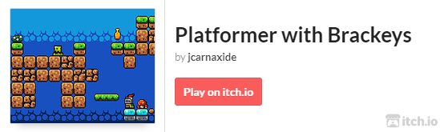

# platformer_with_brackeys
Platformer built in Godot, following a [tutorial by Brackeys](https://youtu.be/LOhfqjmasi0?si=mY3pEPV5ailYH4Kc)

# Try it out!

# Github Actions
A Github action to build and deploy the latest version of the game to Itch.io is in place
Whenever a new commit is pushed to the main branch, this action is triggered.
See [godot-ci](https://github.com/marketplace/actions/godot-ci)
Also see [Butler Push](https://github.com/marketplace/actions/butler-push)

# Attributions
<a href="https://www.vecteezy.com/free-vector/knight">Knight Vectors by Vecteezy</a>